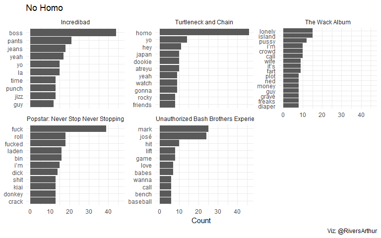

A text analysis of The Lonely Island’s lyrics
================
Arthur Azevedo
12/06/2019

# First things first

*“If you are under 30 and you’re totally cool, then you absolutely know
these guys”*  
The very first sentence of the first song in the third studio album by
*The Lonely Island* (TLI) did find me under 30 and now 6 years later I’m
stil totally cool. With the newest album finally out i had to that a
look, and **why not** thake a look in the old songs too.

So… let’s get the data.

## Extracting the data

I used the [geniusr](https://github.com/ewenme/geniusr) package to
extract all lyrics from all TLI. You can find the script
[here](https://github.com/arzevedo/Text_Mining/blob/master/The%20Lonely%20Island/the_lonely_island_lyrics_scrap.R)
with you want to do it yourself, but you will have to make a genius
account to use their API. Anyway, i scraped the hole thing into a .csv
file:

``` r
tli_lyrics <- read_csv("https://raw.githubusercontent.com/arzevedo/Text_Mining/master/The%20Lonely%20Island/the_lonely_island_lyrics.csv")
```

## *“There’s no way I’ll let my kids listen to it”*

The first thing that I’ll do is to look at the most frequent words,
let’s see per Album.

``` r
tli_lyrics_words <- tli_lyrics %>% 
  unnest_tokens(word, line) %>% 
  mutate(album_name = factor(album_name,
                             levels = c("Incredibad", "Turtleneck and Chain",
                                        "The Wack Album", "Popstar: Never Stop Never Stopping",
                                        "The Unauthorized Bash Brothers Experience", NA)))


tli_lyrics_words %>% 
  filter(!word %in% stop_words$word) %>% 
  group_by(album_name) %>% 
  filter(!is.na(album_name)) %>% 
  count(word, sort = TRUE) %>% 
  top_n(10) %>% 
  ungroup() %>% 
  mutate(word = reorder_within(word, n, album_name)) %>% 
  ggplot(aes(x = word, y = n))+
  geom_col()+
  labs(x = NULL, y = "Count")+
  scale_x_reordered()+
  coord_flip()+
  facet_wrap(~album_name, scales = "free_y")+
  theme_minimal()
```

<!-- -->

As I thought\! lots of *boss*, *jizz* and *pants* in the first one.
Well, a lot of f\*\*\* words in the second.
