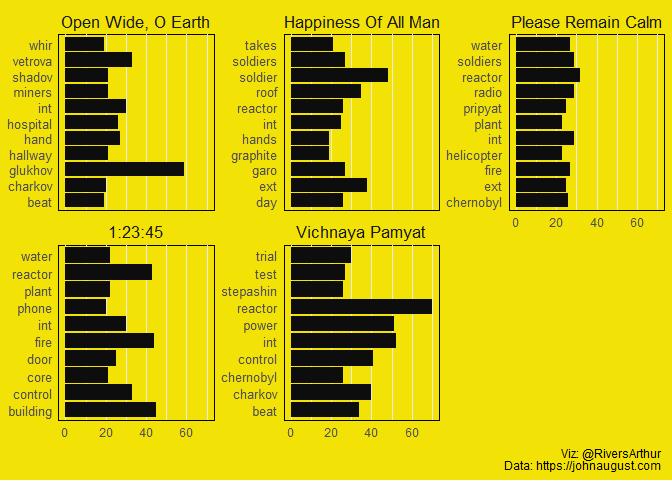

A text analysis of Chernobyl’s screenplay
================
Arthur Azevedo
08/06/2019

# First things first

I have to tell you right away that I loved the series the political,
horror and drama were entangled in a way that amazed me so much that I
couldn’t wait for the next episode. When I saw Mazin on twitter saying
that he gave open access to the screenplay i had to have a look. One
last thing. This code/text may contain spoilers. I will give some
warning before dropping something major to the plot. But be warned.

So… let’s get the data

## Extracting the data

I’ll download the screenplays for reproducibility purposes. I made a
loop in the `download.file` function for every
episode.

``` r
episode_name <- c("11_23_45", "2Please-Remain-Calm", "3Open-Wide-O-Earth",
                  "4The-Happiness-Of-All-Mankind", "5Vichnaya-Pamyat")

for(episode in episode_name){
  download.file(
    paste0("https://johnaugust.com/wp-content/uploads/2019/06/Chernobyl_Episode-",
           episode, ".pdf"), 
    paste0(episode, ".pdf"), mode = "wb"
  )
}
```

## Assembling

The .pdf format is pleasant to work with text. Using the `pdf_text`
function from the `pdftools` package we can assemble the text into
lists. Then we merge all in a *tibble*.

``` r
pdf_names <- paste0(episode_name, ".pdf")
raw_text <- map(pdf_names, pdf_text)

chernobyl <- tibble(episode = pdf_names, text = raw_text) %>% 
  mutate(
    episode =
      case_when(
        .$episode == "11_23_45.pdf" ~ "1:23:45",
        .$episode == "2Please-Remain-Calm.pdf" ~ "Please Remain Calm",
        .$episode == "3Open-Wide-O-Earth.pdf" ~ "Open Wide, O Earth",
        .$episode == "4The-Happiness-Of-All-Mankind.pdf" ~ "The Happiness Of All Mankind",
        TRUE           ~ "Vichnaya Pamyat"
      )
  )
```

## Tidying

[The *tidy* format](https://www.tidyverse.org/learn/) makes easy
handling data. Julia Silge and David Robinson defining tidy text format
as being a table with one token per row. A token is a meaningful unit of
text. With all that said, let’s travel to the north of Ukraine.

``` r
chernobyl_tidy <- chernobyl %>% 
  unnest %>% # pdfs_text is a list
  unnest_tokens(word, text, strip_numeric = TRUE)
```

## Filtering

Create a *data set* without stop words.

``` r
chernobyl_tidy_fil <- chernobyl_tidy %>% 
  anti_join(stop_words)
```

    ## Joining, by = "word"

``` r
characters <- c("legasov", "shcherbina", "dyatlov", "bacho", "pavel",
                "shcherbina", "khomyuk", "toptunov", "akimov", "lyudmilla",
                "bryukhanov", "tarakanov", "fomin", "sitnikov", "gorbachev",
                "vasily", "pikalov", "dmitri", "yuvchenko", "gorbachenko",
                "stolyarchuk")
```

``` r
chernobyl_tidy_fil %>% 
  group_by(episode, word) %>% 
  count(sort = TRUE) %>% 
  filter(!word %in% characters) %>% 
  group_by(episode) %>% 
  top_n(10, n) %>%
  ungroup() %>% 
  mutate(
    episode = fct_reorder(episode, n)
  ) %>% 
  ggplot(aes(word, n))+
  geom_col(fill = "#0D0D0D")+
  facet_wrap(~episode, scales = "free_y")+
  coord_flip()+
  theme_minimal()+theme(legend.position = "none")+
  labs(caption = "Viz: @RiversArthur \nData: https://johnaugust.com ",
       x = NULL, y = NULL)+
  theme(panel.background = element_rect(fill = "#F2E205"), strip.text = element_text(size = 13),
        panel.grid.major.y = element_blank(),
        axis.text.y = element_text(size = 10),
        plot.background = element_rect(fill = "#F2E205", color = "#F2E205"))
```

<!-- -->
